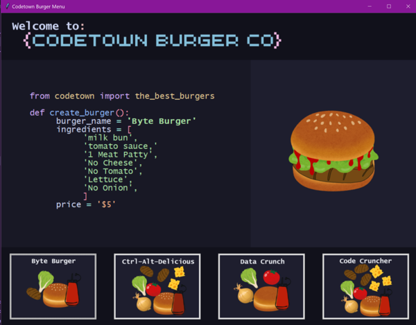

# Orders

This program creates a graphical user interface intended for displaying in the fictional burger restaurant "Codetown Burger Co".

The display cycles through each of the 4 named burgers every 5 seconds. Users can press the buttons along the bottom to view information for a specific burger, and the program will reset the cycle, displaying the next burger 5 seconds after the user selection.

Developed to fulfill the requirements of Programming Task 3 for COSC110, T1 2024.

## Usage

Ensure that the neccesary image files are located within the same directory as "menu.py".

For files in alternate locations, or with alternate names, the filename constants in "meny.py" will need to be updated with the correct file paths.

```bash
python3 menu.py
```

## Example Screenshot



## Author

TanyaPegasus

## Credits

All images created in Canva, using elements available in their "Free" tier plan
https://www.canva.com/

The style of the display is inspired by the popular code theme "Catppuccin", and uses some of the colour hex codes found here https://catppuccin.com/palette
